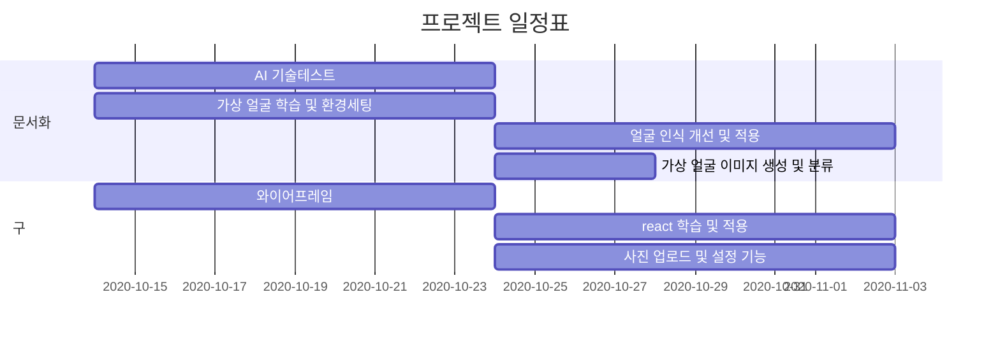

### Hi there 👋   FIRST 23.12.11.LIST  8.17 FIRSTPROJECT

## 📖 Gantt :fire:

###KIM MIN GU 😉😊  

# 💪Skills
### Platforms & Languages

### Tools

# :mailbox_with_mail: Contacts

<!--
**mmingu/mmingu** is a ✨ _special_ ✨ repository because its `README.md` (this file) appears on your GitHub profile.

Here are some ideas to get you started:

- 🔭 I’m currently working on ...
- 🌱 I’m currently learning ...
- 👯 I’m looking to collaborate on ...
- 🤔 I’m looking for help with ...
- 💬 Ask me about ...
- 📫 How to reach me: ...
- 😄 Pronouns: ...
- ⚡ Fun fact: ...
-->
