### Hi there 👋   FIRST 23.12.11.LIST  8.17 FIRSTPROJECT

```mermaid
gantt
    title A Gantt Diagram
    dateFormat YYYY-MM-DD
    section 문서화
         제안서 작성       :done, a1, 2023-08-15, 1d
        구성도 작성    :a2, 2023-08-16, 1d
        설치 메뉴얼   :a3, 2023-08-17, 6d
        시연 PPT       : a4, 2023-08-23, 2d
    section 구현
        네트워크 :a1,2023-08-17, 1d
        서버(도커)    :a2, 2023-08-21,  1d
        서버(젠킨스)    :a2, 2023-08-22,  1d
        서버(쿠버네티스)    :a2, 2023-08-23,1d
        
```

###KIM MIN GU 😉😊  

# 💪Skills
### Platforms & Languages

### Tools

# :mailbox_with_mail: Contacts

<!--
**mmingu/mmingu** is a ✨ _special_ ✨ repository because its `README.md` (this file) appears on your GitHub profile.

Here are some ideas to get you started:

- 🔭 I’m currently working on ...
- 🌱 I’m currently learning ...
- 👯 I’m looking to collaborate on ...
- 🤔 I’m looking for help with ...
- 💬 Ask me about ...
- 📫 How to reach me: ...
- 😄 Pronouns: ...
- ⚡ Fun fact: ...
-->
